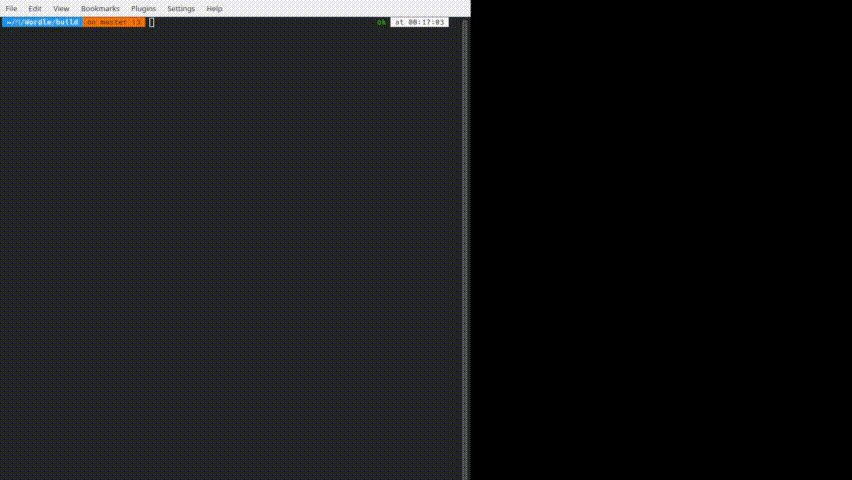

# Wordle Clone

This is a Wordle clone implemented using C++ and QML. Oirignal Wordle game can be found [here](https://www.nytimes.com/games/wordle/index.html).

## Quick Demo

## Description

Wordle is a word-guessing game where players try to guess a hidden word by guessing different combinations of letters. This clone aims to replicate the gameplay and experience of the original Wordle game. Source code contains five main components:
- `main.cpp`: Main entry point of the application. It register the C++ classes to QML engine. All C++ classes are registered as a singleton since there is only one instance of each class. It also connects the signals and slots between C++ and QML, sets fonts, and application icon.
- `UserInteractor`: Handles user input including keyboard and mouse events.
- `GameManager`: Manages the game state and handles game logic. It is parent of `BoardModel` and `Stats` classes.
- `BoardModel`: Stores the game board and handles the game board logic. It is a subclass of `QAbstractTableModel` and is used as a model for the `TableView` QML component.
- `Stats`: Stores the game statistics and handles the game statistics logic. It persist the statistics data to a JSON file which located in `resources/stats.json`. User can reset the statistics data by clicking the "Reset Stats" button.

And QML files:
- `main.qml`: Main QML file which contains the game UI.
- `MBoard.qml`: QML file which contains `TableView` component. It is used to display the game board.
- `MCell.qml`: QML file which represents a single cell in the game board. States and transitions are defined in this file.
- `MControls.qml`: QML file which contains the How to Play and Play/Exit buttons.
- `MHeader.qml`: QML file which contains the game header. It is used to display the game title and statstics button.
- `MKey.qml`: QML file which represents a single key in the keyboard. Color animations for the keyboard are defined in this file.
- `MKeyboardf.qml`: QML file which contains the keyboard. It is used to display the keyboard. A scheme manually created for the keyboard.
- `MPopup.qml`: QML file which contains the popup notification. It is used to display the game result, warnings and errors.
- `MStats.qml`: QML file which contains the statistics popup. It is used to display the game statistics.
- `MWelcome.qml`: QML file which contains the welcome content. It is used when game is not started yet.

## Todo

- [ ] Add unit tests
- [ ] Improve error handling
- [ ] Remove debug messages
- [ ] Re-organize the project structure
- [ ] Add more comments
- [ ] Add more documentation

## Technologies Used

- C++
- QML

## Getting Started

To run the Wordle clone, follow these steps:

1. Clone the repository: `git clone https://github.com/alihan-tadal/wordle.git`
2. You may wish to change the word list in `resources/words.txt` to suit your needs. Make sure all words are in lowercase and are separated by newlines.
3. Install the necessary dependencies. You will need Qt 6.2 or later.
4. Build the project using CMake. You should change the `CMAKE_PREFIX_PATH` variable in `CMakeLists.txt` to point to your Qt installation.
5. Run the executable.
